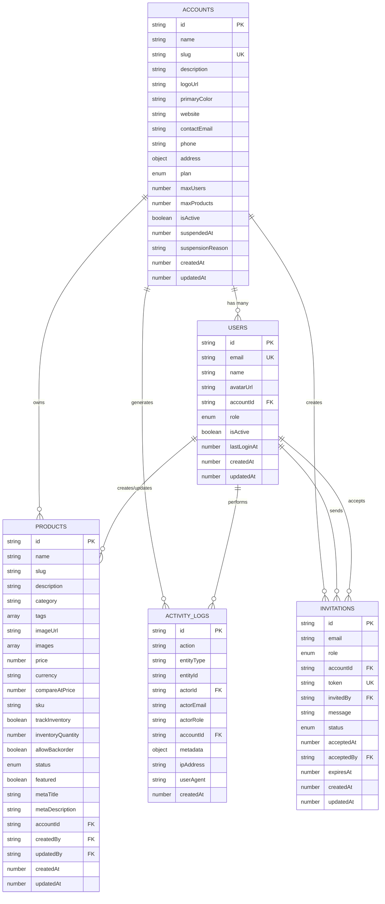
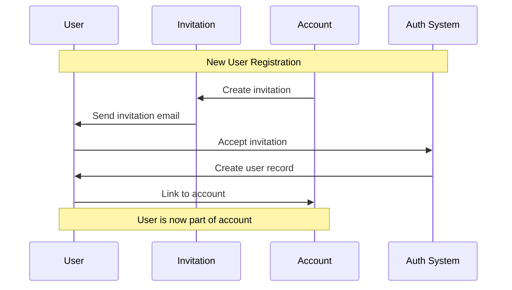
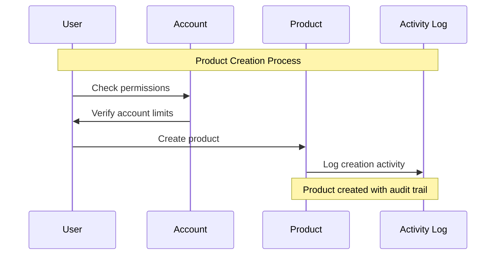
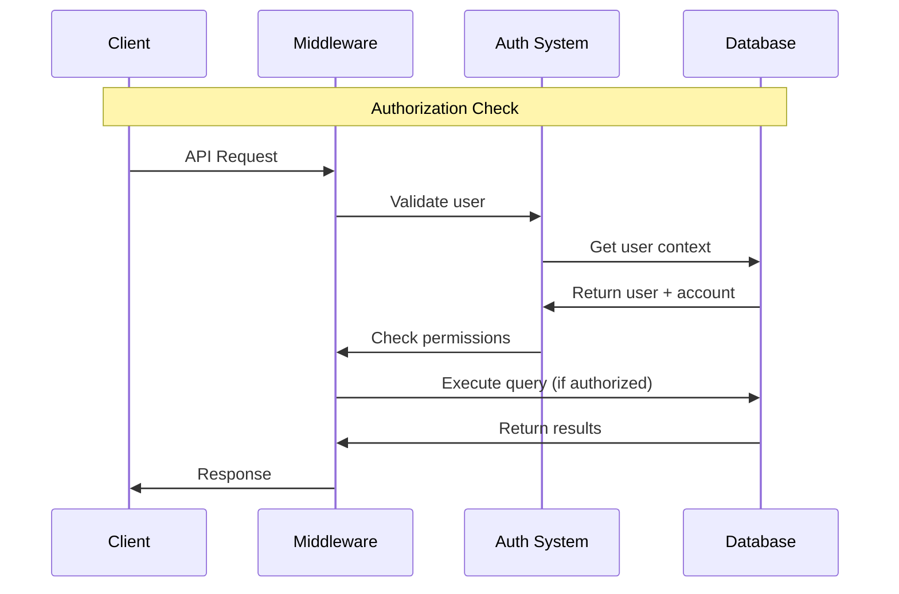

# Database Entity Relationship Diagram

## Entity Relationship Overview



## Detailed Relationships

### 1. Users ↔ Accounts (Many-to-One)

```
USERS.accountId → ACCOUNTS.id
```

**Relationship Type**: Many-to-One (Each user belongs to exactly one account)

**Business Rules**:
- A user can only belong to one account
- An account can have multiple users
- When a user is created, they must be assigned to an account
- Super admins may not have an accountId (platform-level users)

**Constraints**:
- `users.accountId` is optional (for super admins)
- `users.accountId` references `accounts.id`
- Cascade delete: When account is deleted, all users are deleted

### 2. Accounts ↔ Products (One-to-Many)

```
PRODUCTS.accountId → ACCOUNTS.id
```

**Relationship Type**: One-to-Many (Each account owns multiple products)

**Business Rules**:
- Products are always owned by exactly one account
- Accounts can have multiple products (up to their limit)
- Products cannot be transferred between accounts
- Product access is restricted to account members

**Constraints**:
- `products.accountId` is required
- `products.accountId` references `accounts.id`
- Cascade delete: When account is deleted, all products are deleted

### 3. Users ↔ Products (Creator/Updater)

```
PRODUCTS.createdBy → USERS.id
PRODUCTS.updatedBy → USERS.id
```

**Relationship Type**: Many-to-Many (Users can create/update multiple products)

**Business Rules**:
- Products track who created and last updated them
- Only users within the same account can modify products
- Audit trail is maintained for all product changes

**Constraints**:
- `products.createdBy` is required
- `products.updatedBy` is required
- Both reference `users.id`
- No cascade delete (preserve audit trail)

### 4. Activity Logs (Audit Trail)

```
ACTIVITY_LOGS.actorId → USERS.id
ACTIVITY_LOGS.accountId → ACCOUNTS.id
```

**Relationship Type**: Many-to-One (Multiple logs per user/account)

**Business Rules**:
- All significant actions are logged
- Logs are immutable once created
- Logs provide complete audit trail
- Account-scoped logs for data isolation

**Constraints**:
- `activityLogs.actorId` is required
- `activityLogs.accountId` is optional (for platform-level actions)
- No cascade delete (preserve audit trail)

### 5. Invitations

```
INVITATIONS.accountId → ACCOUNTS.id
INVITATIONS.invitedBy → USERS.id
INVITATIONS.acceptedBy → USERS.id
```

**Relationship Type**: Many-to-One (Multiple invitations per account/user)

**Business Rules**:
- Invitations are account-scoped
- Only account admins can send invitations
- Invitations have expiration dates
- Accepted invitations create new users

**Constraints**:
- `invitations.accountId` is required
- `invitations.invitedBy` is required
- `invitations.acceptedBy` is optional (until accepted)
- Cascade delete: When account is deleted, invitations are deleted

## Data Flow Diagrams

### User Registration Flow



### Product Creation Flow



### Authorization Flow



## Index Strategy

### Primary Indexes

```sql
-- Users
CREATE INDEX idx_users_email ON users(email);
CREATE INDEX idx_users_account ON users(accountId);
CREATE INDEX idx_users_role ON users(role);

-- Accounts
CREATE INDEX idx_accounts_slug ON accounts(slug);
CREATE INDEX idx_accounts_plan ON accounts(plan);
CREATE INDEX idx_accounts_active ON accounts(isActive);

-- Products
CREATE INDEX idx_products_account ON products(accountId);
CREATE INDEX idx_products_account_slug ON products(accountId, slug);
CREATE INDEX idx_products_account_status ON products(accountId, status);
CREATE INDEX idx_products_account_category ON products(accountId, category);
CREATE INDEX idx_products_account_featured ON products(accountId, featured);
CREATE INDEX idx_products_created_by ON products(createdBy);
CREATE INDEX idx_products_updated_by ON products(updatedBy);

-- Activity Logs
CREATE INDEX idx_activity_account ON activityLogs(accountId);
CREATE INDEX idx_activity_actor ON activityLogs(actorId);
CREATE INDEX idx_activity_entity ON activityLogs(entityType, entityId);
CREATE INDEX idx_activity_action ON activityLogs(action);
CREATE INDEX idx_activity_created ON activityLogs(createdAt);

-- Invitations
CREATE INDEX idx_invitations_email ON invitations(email);
CREATE INDEX idx_invitations_token ON invitations(token);
CREATE INDEX idx_invitations_account ON invitations(accountId);
CREATE INDEX idx_invitations_status ON invitations(status);
CREATE INDEX idx_invitations_invited_by ON invitations(invitedBy);
```

### Composite Indexes for Common Queries

```sql
-- Account-scoped product queries
CREATE INDEX idx_products_account_status_featured 
  ON products(accountId, status, featured);

-- User activity within account
CREATE INDEX idx_activity_account_actor_created 
  ON activityLogs(accountId, actorId, createdAt);

-- Active users by account
CREATE INDEX idx_users_account_active 
  ON users(accountId, isActive);
```

## Data Constraints and Validation

### Business Rules Enforcement

```typescript
// Account limits validation
if (accountUsers.length >= account.maxUsers) {
  throw new ConvexError('Account user limit exceeded')
}

if (accountProducts.length >= account.maxProducts) {
  throw new ConvexError('Account product limit exceeded')
}

// Unique constraints
// - User email must be unique globally
// - Account slug must be unique globally
// - Product slug must be unique within account
// - Invitation token must be unique globally

// Data integrity
// - Users must belong to an active account (except super admins)
// - Products must belong to an active account
// - Activity logs must reference valid users and accounts
```

### Referential Integrity

```typescript
// Cascade delete rules
ON DELETE CASCADE:
  - accounts → users
  - accounts → products
  - accounts → invitations
  - accounts → activityLogs (account-scoped)

ON DELETE RESTRICT:
  - users → products (preserve audit trail)
  - users → activityLogs (preserve audit trail)
  - users → invitations (preserve history)

// Soft delete for important entities
SOFT DELETE:
  - accounts (set isActive = false)
  - users (set isActive = false)
  - products (set status = 'ARCHIVED')
```

## Performance Considerations

### Query Optimization

1. **Account-Scoped Queries**: Always filter by `accountId` first
2. **Pagination**: Use cursor-based pagination for large datasets
3. **Selective Fields**: Only fetch required fields
4. **Batch Operations**: Group related operations

### Scaling Strategies

1. **Horizontal Partitioning**: Partition by `accountId`
2. **Read Replicas**: For analytics and reporting
3. **Caching**: Cache frequently accessed account data
4. **Archive Strategy**: Move old activity logs to cold storage

## Security Considerations

### Data Isolation

- All queries are account-scoped (except super admin)
- Cross-account data access is prevented at the database level
- Sensitive data is encrypted at rest

### Audit Trail

- All mutations are logged with full context
- Logs are immutable and tamper-evident
- Regular audit reports are generated

### Access Control

- Role-based permissions are enforced at the application level
- Database access is restricted to application services
- All API endpoints require authentication

This database design provides a solid foundation for a multi-tenant SaaS application with proper data isolation, audit trails, and scalability considerations.