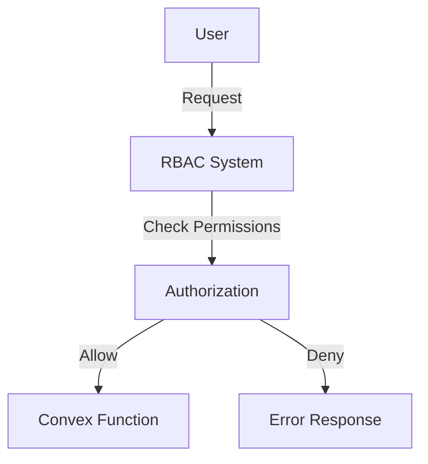

# RBAC Architecture Documentation

## Overview

This document describes the Role-Based Access Control (RBAC) system implemented for the SaaS Starter Kit. The system provides a multi-tenant architecture with hierarchical permissions and secure data isolation.

## Architecture Diagram



```mermaid
┌─────────────────────────────────────────────────────────────────┐
│                        RBAC System Overview                     │
└─────────────────────────────────────────────────────────────────┘

┌─────────────────┐    ┌─────────────────┐    ┌─────────────────┐
│   SUPER_ADMIN   │    │      ADMIN      │    │     MEMBER      │
│                 │    │                 │    │                 │
│ • Manage all    │    │ • Manage own    │    │ • Read access   │
│   accounts      │    │   account       │    │   to account    │
│ • Platform      │    │ • Manage users  │    │   products      │
│   oversight     │    │ • Manage        │    │ • Limited       │
│ • System admin  │    │   products      │    │   operations    │
└─────────────────┘    └─────────────────┘    └─────────────────┘
        │                       │                       │
        └───────────────────────┼───────────────────────┘
                                │
                    ┌─────────────────┐
                    │    ACCOUNTS     │
                    │                 │
                    │ • Multi-tenant  │
                    │ • Data isolation│
                    │ • Resource      │
                    │   limits        │
                    └─────────────────┘
                                │
                    ┌─────────────────┐
                    │    PRODUCTS     │
                    │                 │
                    │ • Account-scoped│
                    │ • CRUD with     │
                    │   permissions   │
                    │ • Audit logging │
                    └─────────────────┘
```

## Database Schema

### Users Table

```typescript
users: {
  email: string,
  name: string,
  avatarUrl?: string,
  accountId?: Id<'accounts'>,
  role: 'SUPER_ADMIN' | 'ADMIN' | 'MEMBER',
  isActive: boolean,
  lastLoginAt?: number,
  createdAt: number,
  updatedAt: number
}
```

**Indexes:**
- `by_email`: For authentication
- `by_account`: For account-scoped queries
- `by_role`: For role-based filtering

### Accounts Table

```typescript
accounts: {
  name: string,
  slug: string,
  description?: string,
  logoUrl?: string,
  primaryColor?: string,
  website?: string,
  contactEmail?: string,
  phone?: string,
  address?: {
    street: string,
    city: string,
    state: string,
    zipCode: string,
    country: string
  },
  plan: 'FREE' | 'BASIC' | 'PRO' | 'ENTERPRISE',
  maxUsers: number,
  maxProducts: number,
  isActive: boolean,
  suspendedAt?: number,
  suspensionReason?: string,
  createdAt: number,
  updatedAt: number
}
```

**Indexes:**
- `by_slug`: For URL-friendly access
- `by_plan`: For plan-based queries
- `by_active`: For status filtering

### Products Table

```typescript
products: {
  name: string,
  slug: string,
  description?: string,
  category?: string,
  tags: string[],
  imageUrl?: string,
  images: string[],
  price: number,
  currency: string,
  compareAtPrice?: number,
  sku?: string,
  trackInventory: boolean,
  inventoryQuantity?: number,
  allowBackorder: boolean,
  status: 'DRAFT' | 'ACTIVE' | 'ARCHIVED',
  featured: boolean,
  metaTitle?: string,
  metaDescription?: string,
  accountId: Id<'accounts'>,
  createdBy: Id<'users'>,
  updatedBy: Id<'users'>,
  createdAt: number,
  updatedAt: number
}
```

**Indexes:**
- `by_account`: For account-scoped queries
- `by_slug`: For unique slug per account
- `by_status`: For status filtering
- `by_category`: For category filtering
- `by_featured`: For featured products

## Role Hierarchy

### SUPER_ADMIN
- **Scope**: Platform-wide
- **Permissions**:
  - Manage all accounts
  - View all data across accounts
  - Suspend/activate accounts
  - Platform administration
  - System monitoring and analytics

### ADMIN
- **Scope**: Single account
- **Permissions**:
  - Manage account settings
  - Invite/remove users
  - Manage all products in account
  - View account analytics
  - Configure account limits

### MEMBER
- **Scope**: Single account (read-only)
- **Permissions**:
  - View account products
  - View account information
  - Limited product operations (if configured)

## Authorization Functions

### Core Authorization

```typescript
// Get current authenticated user
const user = await getCurrentUser(ctx)

// Get current user's account
const { user, account } = await getCurrentUserAccount(ctx)

// Require minimum role
const user = await requireMinimumRole(ctx, 'ADMIN')

// Require account access
const account = await requireAccountAccess(ctx, accountId)

// Check if user is super admin
const isSuperAdmin = await checkSuperAdmin(ctx)

// Check if user is account admin
const isAdmin = await checkAccountAdmin(ctx, accountId)
```

### Middleware Usage

```typescript
import { withAuth, withRole, withAccountAccess } from './middleware'

// Require authentication
export const myMutation = mutation({
  args: { /* ... */ },
  handler: withAuth(async (ctx, args, user) => {
    // User is authenticated
  })
})

// Require specific role
export const adminMutation = mutation({
  args: { /* ... */ },
  handler: withRole('ADMIN', async (ctx, args, user) => {
    // User has ADMIN role or higher
  })
})

// Require account access
export const accountMutation = mutation({
  args: { accountId: v.optional(v.id('accounts')) },
  handler: withAccountAccess(async (ctx, args, user, account) => {
    // User has access to the account
  })
})
```

## Data Isolation

### Account-Scoped Data

All business data (products, users, etc.) is scoped to accounts:

```typescript
// Products are always filtered by account
const products = await ctx.db
  .query('products')
  .withIndex('by_account', (q) => q.eq('accountId', user.accountId))
  .collect()

// Users can only see users in their account
const accountUsers = await ctx.db
  .query('users')
  .withIndex('by_account', (q) => q.eq('accountId', user.accountId))
  .collect()
```

### Cross-Account Access

Only SUPER_ADMIN can access data across accounts:

```typescript
if (user.role !== 'SUPER_ADMIN') {
  throw new ConvexError('Insufficient permissions')
}

// Super admin can access all accounts
const allAccounts = await ctx.db.query('accounts').collect()
```

## Security Best Practices

### 1. Always Validate User Context

```typescript
// ❌ Bad: No user validation
export const badMutation = mutation({
  handler: async (ctx, args) => {
    // Direct database access without auth
    return await ctx.db.query('products').collect()
  }
})

// ✅ Good: Proper user validation
export const goodMutation = mutation({
  handler: async (ctx, args) => {
    const user = await getCurrentUser(ctx)
    return await ctx.db
      .query('products')
      .withIndex('by_account', (q) => q.eq('accountId', user.accountId))
      .collect()
  }
})
```

### 2. Use Account-Scoped Queries

```typescript
// ❌ Bad: Global query
const product = await ctx.db.get(productId)

// ✅ Good: Validate account access
const product = await ctx.db.get(productId)
if (!product || product.accountId !== user.accountId) {
  throw new ConvexError('Product not found')
}
```

### 3. Log Security Events

```typescript
// Log important actions
await logActivity(ctx, 'product.created', 'product', productId, {
  productName: args.name,
  category: args.category
})
```

## Activity Logging

All significant actions are logged for audit purposes:

```typescript
activityLogs: {
  action: string,           // e.g., 'product.created'
  entityType: string,       // e.g., 'product'
  entityId: string,         // ID of affected entity
  actorId: Id<'users'>,     // Who performed the action
  actorEmail: string,       // Actor's email
  actorRole: string,        // Actor's role
  accountId?: Id<'accounts'>, // Account context
  metadata?: any,           // Additional context
  ipAddress?: string,       // Request IP
  userAgent?: string,       // Request user agent
  createdAt: number         // Timestamp
}
```

## Rate Limiting

The middleware includes basic rate limiting:

```typescript
export const rateLimitedMutation = mutation({
  args: { /* ... */ },
  handler: withRateLimit(
    10,        // Max 10 requests
    60000,     // Per minute
    (ctx, args) => ctx.auth.getUserIdentity()?.email || 'anonymous',
    async (ctx, args) => {
      // Your mutation logic
    }
  )
})
```

## Error Handling

### Standard Error Responses

```typescript
// Authentication required
throw new ConvexError('Authentication required')

// Insufficient permissions
throw new ConvexError('Insufficient permissions')

// Resource not found
throw new ConvexError('Resource not found')

// Account limit exceeded
throw new ConvexError('Account limit exceeded')

// Rate limit exceeded
throw new ConvexError('Rate limit exceeded. Please try again later.')
```

## Testing Authorization

### Unit Tests

```typescript
// Test role-based access
test('admin can create products', async () => {
  const ctx = createMockContext({ role: 'ADMIN' })
  const result = await createProduct(ctx, { name: 'Test Product' })
  expect(result).toBeDefined()
})

test('member cannot create products', async () => {
  const ctx = createMockContext({ role: 'MEMBER' })
  await expect(createProduct(ctx, { name: 'Test Product' }))
    .rejects.toThrow('Insufficient permissions')
})
```

### Integration Tests

```typescript
// Test account isolation
test('users cannot access other accounts data', async () => {
  const account1 = await createAccount({ name: 'Account 1' })
  const account2 = await createAccount({ name: 'Account 2' })

  const user1 = await createUser({ accountId: account1._id, role: 'ADMIN' })
  const product2 = await createProduct({ accountId: account2._id })

  const ctx = createMockContext({ user: user1 })
  const result = await getProduct(ctx, { productId: product2._id })

  expect(result).toBeNull()
})
```

## Migration Guide

### Adding New Roles

1. Update the schema:
```typescript
role: v.union(
  v.literal('SUPER_ADMIN'),
  v.literal('ADMIN'),
  v.literal('MEMBER'),
  v.literal('NEW_ROLE')  // Add new role
)
```

2. Update authorization functions:
```typescript
const roleHierarchy = {
  'SUPER_ADMIN': 4,
  'ADMIN': 3,
  'NEW_ROLE': 2,  // Add hierarchy level
  'MEMBER': 1
}
```

3. Update middleware and permissions as needed.

### Adding New Permissions

1. Create new authorization functions in `auth.ts`
2. Add corresponding middleware in `middleware.ts`
3. Update documentation and tests

## Performance Considerations

### Indexing Strategy

- All account-scoped queries use compound indexes starting with `accountId`
- Role-based queries use dedicated indexes
- Frequently filtered fields have dedicated indexes

### Query Optimization

```typescript
// ✅ Good: Use specific indexes
const products = await ctx.db
  .query('products')
  .withIndex('by_account', (q) => q.eq('accountId', accountId))
  .collect()

// ❌ Bad: Full table scan
const products = await ctx.db
  .query('products')
  .filter((q) => q.eq(q.field('accountId'), accountId))
  .collect()
```

### Caching Strategy

- User context is cached per request
- Account information is cached for frequently accessed data
- Role checks are optimized to avoid repeated database calls

## Monitoring and Analytics

### Key Metrics

- Authentication failures
- Authorization denials
- Account usage vs limits
- API rate limiting events
- Security events and anomalies

### Logging

- All security events are logged with full context
- Failed authorization attempts are tracked
- Account limit violations are monitored
- Suspicious activity patterns are flagged

## Conclusion

This RBAC system provides:

- ✅ **Multi-tenant architecture** with complete data isolation
- ✅ **Hierarchical role system** with clear permission boundaries
- ✅ **Comprehensive authorization** functions and middleware
- ✅ **Audit logging** for all significant actions
- ✅ **Security best practices** built into the framework
- ✅ **Performance optimization** through proper indexing
- ✅ **Extensible design** for future requirements

The system follows the principle of least privilege and ensures that users can only access data and perform actions appropriate to their role and account context.
