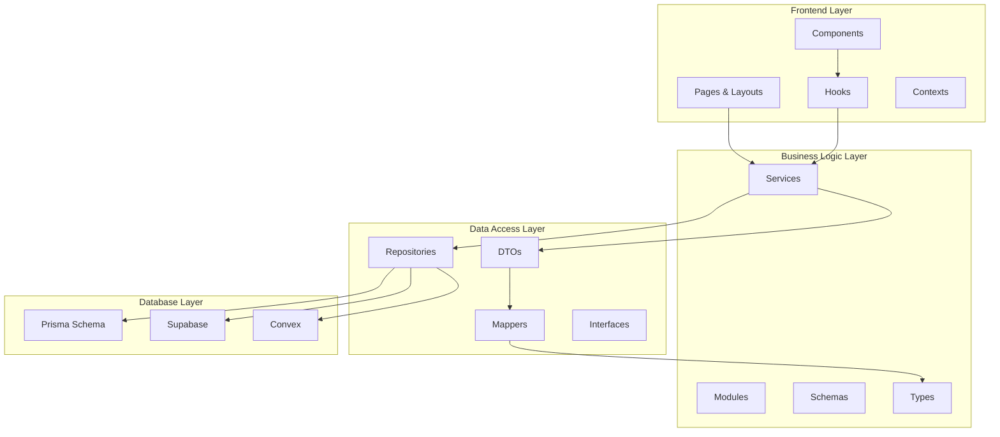

# Architecture Overview

LegalTrack follows a clean, layered architecture that promotes separation of concerns, maintainability, and scalability. This document provides a comprehensive overview of the architectural decisions and patterns used throughout the application.

## Architectural Principles

### 1. Separation of Concerns
Each layer has a specific responsibility and doesn't directly depend on implementation details of other layers.

### 2. Dependency Inversion
High-level modules don't depend on low-level modules. Both depend on abstractions.

### 3. Single Responsibility
Each class, function, and module has a single, well-defined purpose.

### 4. Open/Closed Principle
Software entities are open for extension but closed for modification.

## Layer Architecture



## Layer Descriptions

### Frontend Layer (Presentation)
**Location**: `src/app/`, `src/components/`, `src/hooks/`, `src/contexts/`

**Responsibilities**:
- User interface rendering
- User interaction handling
- State management (UI state)
- Navigation and routing
- Form validation and submission

**Key Components**:
- **Pages**: Next.js App Router pages and layouts
- **Components**: Reusable UI components built with Shadcn UI
- **Hooks**: Custom React hooks for data fetching and state management
- **Contexts**: Global state management for authentication, themes, etc.

**Dependencies**: Business Logic Layer (Services)

### Business Logic Layer (Application)
**Location**: `src/services/`, `src/modules/`, `src/schemas/`, `src/types/`

**Responsibilities**:
- Business rules implementation
- Data validation and transformation
- Orchestration between different data sources
- Error handling and logging
- Authorization and permissions

**Key Components**:
- **Services**: Core business logic and use cases
- **Modules**: Feature-specific business modules
- **Schemas**: Zod validation schemas
- **Types**: TypeScript interfaces and type definitions

**Dependencies**: Data Access Layer (Repositories)

### Data Access Layer (Infrastructure)
**Location**: `src/repositories/`, `src/types/dto/`, `src/utils/mappers/`, `src/interfaces/`

**Responsibilities**:
- Data persistence abstraction
- External API integration
- Data transformation between layers
- Caching strategies
- Query optimization

**Key Components**:
- **Repositories**: Data access abstraction with consistent interfaces
- **DTOs**: Data Transfer Objects for API communication
- **Mappers**: Transform data between different representations
- **Interfaces**: Repository contracts and abstractions

**Dependencies**: Database Layer (Prisma, Supabase, Convex)

### Database Layer (Persistence)
**Location**: `src/libs/prisma/`, Supabase, Convex

**Responsibilities**:
- Data storage and retrieval
- Database schema management
- Real-time data synchronization
- Data integrity and constraints
- Performance optimization

**Key Components**:
- **Prisma Schema**: Database models and relationships
- **Supabase**: PostgreSQL database with real-time features
- **Convex**: Real-time data synchronization and mutations

## Data Flow

### Request Flow (Top-Down)
```
User Interaction → Component → Hook → Service → Repository → Database
```

### Response Flow (Bottom-Up)
```
Database → Repository → Mapper → DTO → Service → Hook → Component → UI
```

## Design Patterns

### 1. Repository Pattern
**Purpose**: Abstracts data access logic and provides a consistent interface.

**Implementation**:
```typescript
// Interface
interface UserRepository {
  findById(id: string): Promise<User | null>;
  create(userData: CreateUserDTO): Promise<User>;
  update(id: string, userData: UpdateUserDTO): Promise<User>;
  delete(id: string): Promise<void>;
}

// Implementation
class SupabaseUserRepository implements UserRepository {
  // Implementation details
}
```

### 2. Service Layer Pattern
**Purpose**: Encapsulates business logic and coordinates between repositories.

**Implementation**:
```typescript
class UserService {
  constructor(
    private userRepository: UserRepository,
    private profileRepository: ProfileRepository
  ) {}

  async createUserWithProfile(userData: CreateUserDTO): Promise<UserDTO> {
    // Business logic implementation
  }
}
```

### 3. DTO Pattern
**Purpose**: Ensures type safety and data validation across API boundaries.

**Implementation**:
```typescript
// Input DTO
export interface CreateUserDTO {
  email: string;
  name: string;
  role: UserRole;
}

// Output DTO
export interface UserDTO {
  id: string;
  email: string;
  name: string;
  role: UserRole;
  createdAt: Date;
  updatedAt: Date;
}
```

### 4. Mapper Pattern
**Purpose**: Transforms data between different representations.

**Implementation**:
```typescript
class UserMapper {
  static toDTO(user: User): UserDTO {
    return {
      id: user.id,
      email: user.email,
      name: user.name,
      role: user.role,
      createdAt: user.createdAt,
      updatedAt: user.updatedAt
    };
  }

  static fromCreateDTO(dto: CreateUserDTO): Omit<User, 'id' | 'createdAt' | 'updatedAt'> {
    return {
      email: dto.email,
      name: dto.name,
      role: dto.role
    };
  }
}
```

## Error Handling Strategy

### 1. Layer-Specific Error Handling
- **Frontend**: User-friendly error messages and fallback UI
- **Business Logic**: Business rule validation and error transformation
- **Data Access**: Database connection and query error handling
- **Database**: Constraint violations and data integrity errors

### 2. Error Types
```typescript
// Base error class
abstract class AppError extends Error {
  abstract readonly statusCode: number;
  abstract readonly isOperational: boolean;
}

// Specific error types
class ValidationError extends AppError {
  readonly statusCode = 400;
  readonly isOperational = true;
}

class NotFoundError extends AppError {
  readonly statusCode = 404;
  readonly isOperational = true;
}
```

## Performance Considerations

### 1. Database Optimization
- Proper indexing strategies
- Query optimization
- Connection pooling
- Caching frequently accessed data

### 2. Frontend Optimization
- Server-side rendering (SSR)
- Static site generation (SSG)
- Code splitting and lazy loading
- Image optimization

### 3. API Optimization
- Response caching
- Pagination for large datasets
- Efficient data serialization
- Rate limiting

## Security Considerations

### 1. Authentication & Authorization
- JWT token validation
- Role-based access control (RBAC)
- Session management
- Secure password handling

### 2. Data Protection
- Input validation and sanitization
- SQL injection prevention
- XSS protection
- CSRF protection

### 3. API Security
- Rate limiting
- Request validation
- Secure headers
- HTTPS enforcement

## Testing Strategy

### 1. Unit Testing
- Service layer business logic
- Utility functions and mappers
- Component logic

### 2. Integration Testing
- Repository implementations
- API endpoints
- Database operations

### 3. End-to-End Testing
- User workflows
- Critical business processes
- Cross-browser compatibility

## Deployment Architecture

### 1. Development Environment
- Local development with hot reloading
- Local database instances
- Mock external services

### 2. Staging Environment
- Production-like configuration
- Shared database instances
- Integration with external services

### 3. Production Environment
- Optimized builds
- CDN for static assets
- Database clustering
- Monitoring and logging

## Future Considerations

### 1. Microservices Migration
- Service decomposition strategies
- API gateway implementation
- Inter-service communication

### 2. Scalability Improvements
- Horizontal scaling strategies
- Load balancing
- Database sharding

### 3. Technology Evolution
- Framework upgrades
- New feature adoption
- Performance optimizations

---

*This architecture overview serves as a living document that evolves with the application.*