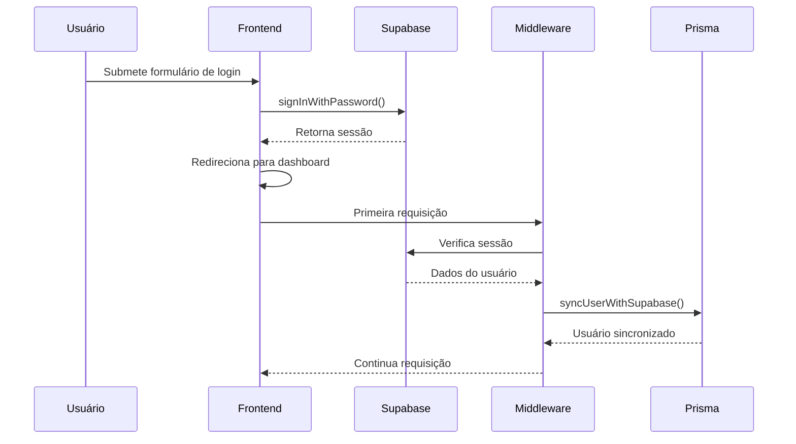
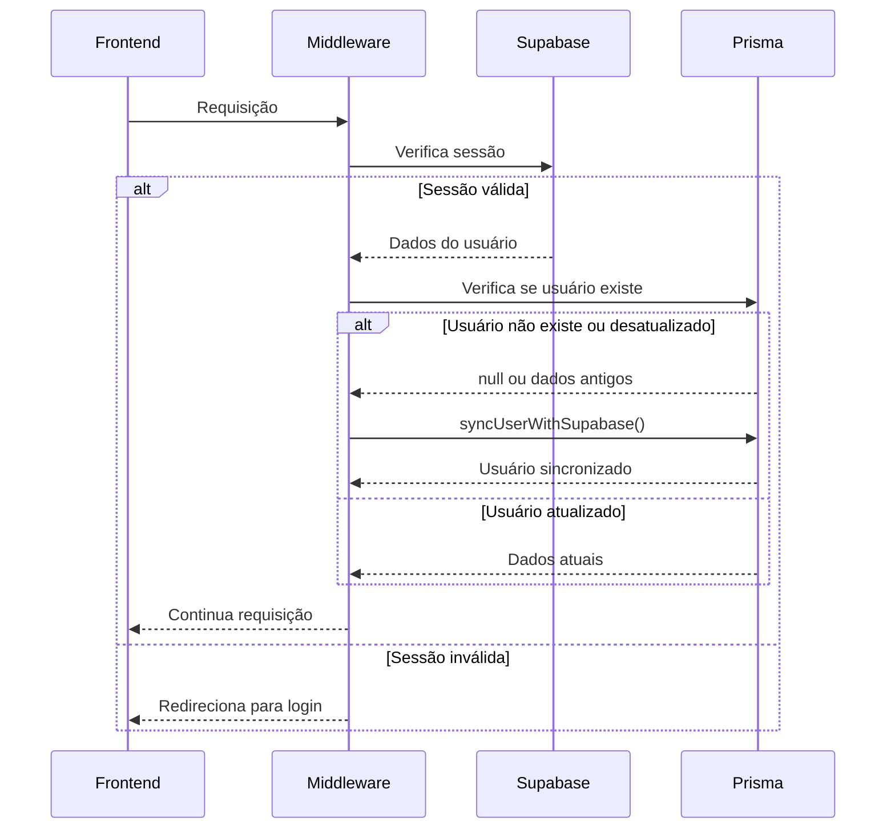

# Fluxo de Autenticação e Sincronização de Dados

Este documento descreve como funciona o sistema de autenticação integrado entre Supabase e Prisma no LegalTrack.

## Visão Geral

O sistema utiliza uma arquitetura híbrida onde:
- **Supabase** gerencia a autenticação (login, registro, sessões)
- **Prisma** gerencia os dados do usuário e relacionamentos
- **Sincronização automática** mantém os dados consistentes entre os dois sistemas

## Componentes Principais

### 1. Modelo de Dados

```prisma
model User {
  id         String   @id @default(cuid())
  email      String   @unique
  name       String?
  avatarUrl  String?
  supabaseId String   @unique @map("supabase_id")
  createdAt  DateTime @default(now()) @map("created_at")
  updatedAt  DateTime @updatedAt @map("updated_at")

  @@map("users")
}
```

O campo `supabaseId` é a chave que conecta o usuário do Supabase com o registro no Prisma.

### 2. Funções de Sincronização

#### `syncUserWithSupabase`
Localizada em `/src/lib/prisma/sync-user.ts`

```typescript
export async function syncUserWithSupabase(supabaseUser: SupabaseUser): Promise<User>
```

**Funcionalidade:**
- Verifica se o usuário já existe no banco Prisma
- Se não existir, cria um novo registro
- Se existir, atualiza os dados se necessário
- Retorna o usuário sincronizado

#### `getUserBySupabaseId`
Localizada em `/src/lib/prisma/get-user.ts`

```typescript
export async function getUserBySupabaseId(supabaseId: string): Promise<User | null>
```

**Funcionalidade:**
- Busca um usuário pelo ID do Supabase
- Retorna `null` se não encontrado
- Usado para verificar se o usuário já existe

### 3. Middleware de Sincronização

Localizado em `/src/middleware.ts`

**Funcionalidade:**
- Intercepta todas as requisições
- Verifica se há uma sessão ativa no Supabase
- Sincroniza automaticamente o usuário quando necessário
- Garante que os dados estejam sempre atualizados

### 4. Hook useUser

Localizado em `/src/hooks/useUser.ts`

**Funcionalidade:**
- Fornece acesso aos dados do usuário autenticado
- Integra dados do Supabase com dados do Prisma
- Gerencia estado de carregamento e erros
- Atualiza automaticamente quando os dados mudam

## Fluxo de Autenticação

### 1. Login/Registro



### 2. Requisições Subsequentes



## Vantagens desta Arquitetura

### 1. **Separação de Responsabilidades**
- Supabase: Autenticação, segurança, sessões
- Prisma: Dados de negócio, relacionamentos, queries complexas

### 2. **Sincronização Automática**
- Dados sempre consistentes
- Sem necessidade de sincronização manual
- Funciona transparentemente para o desenvolvedor

### 3. **Flexibilidade**
- Fácil de estender com novos campos
- Suporte a relacionamentos complexos no Prisma
- Mantém os benefícios de segurança do Supabase

### 4. **Performance**
- Sincronização apenas quando necessário
- Cache automático através do Prisma
- Queries otimizadas

## Configuração de Ambiente

### Variáveis Necessárias

```env
# Supabase
NEXT_PUBLIC_SUPABASE_URL=your_supabase_url
NEXT_PUBLIC_SUPABASE_ANON_KEY=your_supabase_anon_key
SUPABASE_SERVICE_ROLE_KEY=your_service_role_key

# Database
DATABASE_URL=your_database_url
```

### Comandos de Setup

```bash
# Instalar dependências
npm install

# Executar migrações
npx prisma migrate dev

# Gerar cliente Prisma
npx prisma generate

# Executar aplicação
npm run dev
```

## Troubleshooting

### Problemas Comuns

1. **Usuário não sincronizado**
   - Verificar se o middleware está funcionando
   - Checar logs de erro no console
   - Validar configuração do Supabase

2. **Dados desatualizados**
   - Limpar cache do navegador
   - Verificar se a sincronização está sendo chamada
   - Checar se há erros na função `syncUserWithSupabase`

3. **Erro de autenticação**
   - Verificar variáveis de ambiente
   - Validar configuração do Supabase
   - Checar se as chaves estão corretas

### Logs Úteis

```typescript
// Para debug, adicione logs nas funções:
console.log('Sincronizando usuário:', supabaseUser.id)
console.log('Usuário encontrado:', existingUser)
console.log('Usuário criado/atualizado:', user)
```

## Próximos Passos

1. **Implementar refresh automático de tokens**
2. **Adicionar suporte a roles e permissões**
3. **Implementar logout em todos os dispositivos**
4. **Adicionar auditoria de sessões**
5. **Implementar 2FA (autenticação de dois fatores)**

## Conclusão

Este sistema fornece uma base sólida para autenticação e gerenciamento de usuários, combinando a simplicidade do Supabase com a flexibilidade do Prisma. A sincronização automática garante que os dados estejam sempre consistentes, enquanto mantém a performance e a segurança.